Jarkom-Modul-3-ITB01-2022

# :zap: **Jarkom-Modul-3-ITB01-2022** :zap:

| Nama                               | NRP            |
|------------------------------------|----------------|
| 	:adult: Rafael Nixon              | 05311940000025 |
| 	:adult: Fairuz Azka Maulana       | 5027201017     |
| 	:adult: Muhammad Firdho Kustiawan | 5027201005     | 
<br/>


# :large_blue_circle: **Topologi Jaringan** :large_blue_circle: 

<br>

# :large_blue_circle: **Soal 1** :large_blue_circle: 
Loid bersama Franky berencana membuat peta tersebut dengan kriteria WISE sebagai DNS Server, Westalis sebagai DHCP Server, Berlint sebagai Proxy Server (1),

### :triangular_flag_on_post: **Jawaban:**
Kami melakukan konfigurasi pada setiap node yang ada pada topologi tersebut.

### :rocket: **WISE** [DNS Server]
```JavaScript
auto eth0
iface eth0 inet static
    address 10.45.2.2
    netmask 255.255.255.0
    gateway 10.45.2.1
```
Wise sebagai DNS Server sehingga perlu melakukan instalasi bind9
```JavaScript
echo nameserver 192.168.122.1 > /etc/resolv.conf
apt-get update
apt-get install bind9 -y
```

### :rocket: **Berlint** [Proxy Server]
```JavaScript
auto eth0
iface eth0 inet static
    address 10.45.2.3
    netmask 255.255.255.0
    gateway 10.45.2.1
```
Berlint sebagai Proxy Server sehingga perlu melakukan instalasi squid
```JavaScript
echo nameserver 192.168.122.1 > /etc/resolv.conf
apt-get update
apt-get install libapache2-mod-php7.0 -y
apt-get install squid -y
```

### :rocket: **Westalis** [DHCP Server]
```JavaScript
auto eth0
iface eth0 inet static
    address 10.45.2.4
    netmask 255.255.255.0
    gateway 10.45.2.1
```
Westalis sebagai DHCP Server sehingga perlu melakukan instalasi isc-dhcp-server
```JavaScript
echo nameserver 192.168.122.1 > /etc/resolv.conf
apt-get update
apt-get install isc-dhcp-server -y
```

### :rocket: **Eden** [Web Server]
```JavaScript
#-KEDUA-
auto eth0
iface eth0 inet dhcp
hwaddress ether be:c0:ff:37:bb:09

#-PERTAMA-
auto eth0
iface eth0 inet static
    address 10.45.3.2
    netmask 255.255.255.0
    gateway 10.45.3.1
```
Eden sebagai Web Server sehingga perlu mengunduh dan melakukan instalasi apache
```JavaScript
echo nameserver 192.168.122.1 > /etc/resolv.conf
apt-get install apache2 -y
service apache2 start
apt-get install php -y
apt-get install libapache2-mod-php7.0 -y
apt-get install ca-certificates openssl -y
```

### :rocket: **SSS**, **Garden**, **NewstonCastle**, dan **KemonoPark** [CLIENT]
```JavaScript
auto eth0
iface eth0 inet dhcp
```
<br>


# :large_blue_circle: **Soal 2** :large_blue_circle: 
dan Ostania sebagai DHCP Relay (2). Loid dan Franky menyusun peta tersebut dengan hati-hati dan teliti..

### :triangular_flag_on_post: **Jawaban:**

### :rocket: **Ostania**
Kami melakukan konfigurasi pada node Ostania yang ada pada topologi tersebut.

```JavaScript
auto eth0
iface eth0 inet dhcp

auto eth1
iface eth1 inet static
    address 10.45.1.1
    netmask 255.255.255.0

auto eth2
iface eth2 inet static
    address 10.45.2.1
    netmask 255.255.255.0

auto eth3
iface eth3 inet static
    address 10.45.3.1
    netmask 255.255.255.0
```
Ostania sebagai DHCP Relay sehingga perlu melakukan instalasi isc-dhcp-relay
```JavaScript
apt-get update
apt-get install isc-dhcp-relay -y
iptables -t nat -A POSTROUTING -o eth0 -j MASQUERADE -s 10.45.0.0/16
```

<br>


# :large_blue_circle: **Soal 5** :large_blue_circle: 
Client mendapatkan DNS dari WISE dan client dapat terhubung dengan internet melalui DNS tersebut.

### :triangular_flag_on_post: **Jawaban:**

### :rocket: **WISE**
Melakukan konfigurasi pada file `/etc/dhcp/dhcp.conf` dengan `option domain-name-servers 10.45.2.2;` pada Westalis

<br>

Agar semua client dapat terhubung dengan internat maka pada WISE dikonfigurasi seperti berikut pada file `/etc/bind/named.conf.options`

```JavaScript
options {
        directory \"/var/cache/bind\";

        forwarders {
                8.8.8.8;
                8.8.8.4;
        };

        // dnssec-validation auto;
        allow-query { any; };
        auth-nxdomain no;    # conform to RFC1035
        listen-on-v6 { any; };
};
```

### :rocket: **Testing di SSS, Garden, NewstonCastle, KemonoPark, dan Eden**

Dengan mengkonfigurasi DHCP server dan DHCP Relay seluruh Client yang berada pada switch 1 dan switch 3 akan otomatis mendapatkan IP pada rentang yang telah dikonfigurasi. Untuk contohnya adalah sebagai berikut:

```JavaScript
ip a
```
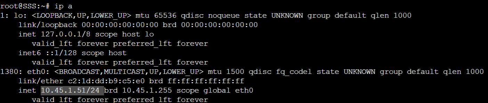
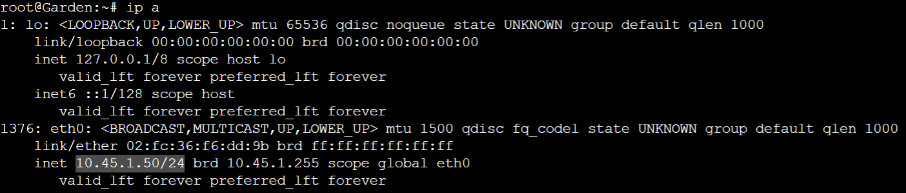
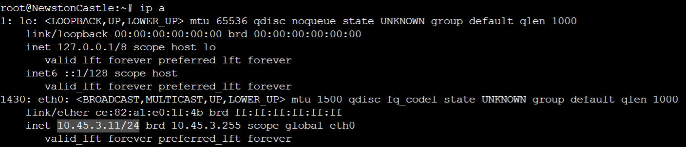
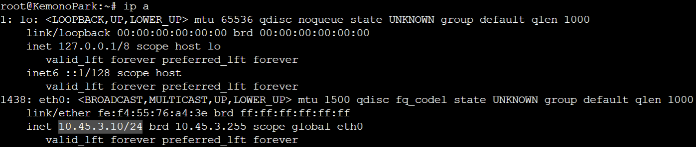
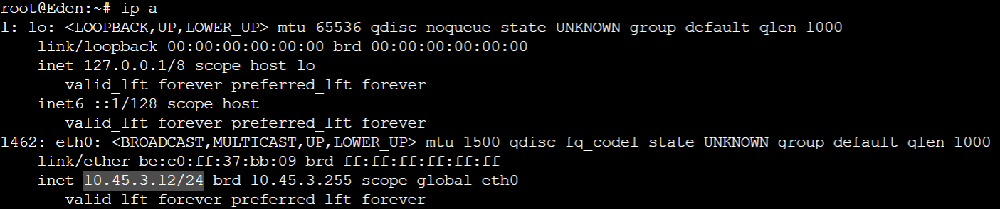

Semua client juga dapat terhubung ke internet

```JavaScript
ping google.com
```

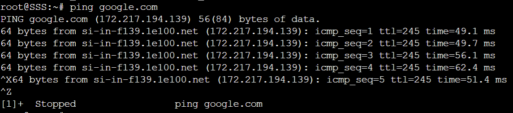
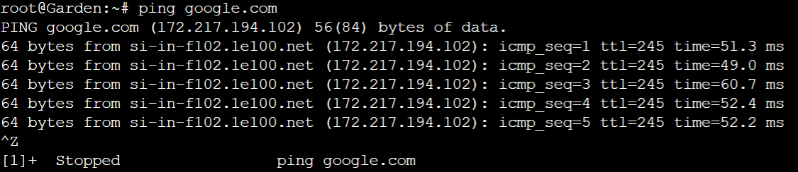
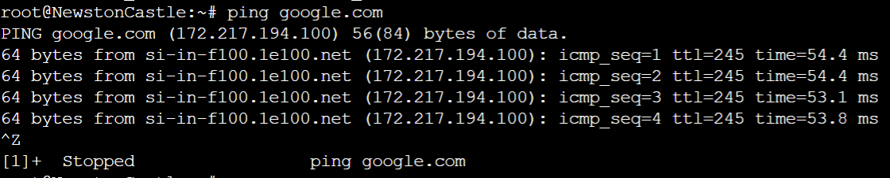
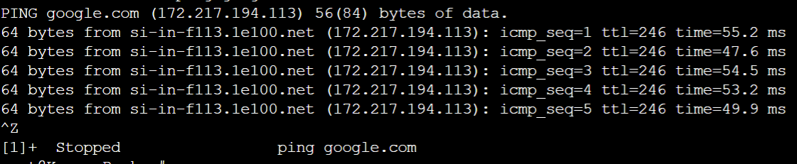
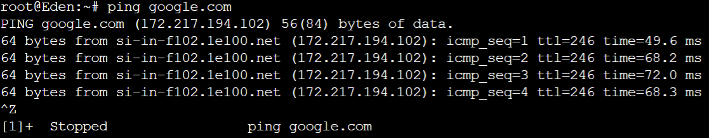
<br>
<br>


# :large_blue_circle: **Soal 6** :large_blue_circle: 
Lama waktu DHCP server meminjamkan alamat IP kepada Client yang melalui Switch1 selama 5 menit sedangkan pada client yang melalui Switch3 selama 10 menit. Dengan waktu maksimal yang dialokasikan untuk peminjaman alamat IP selama 115 menit.

### :triangular_flag_on_post: **Jawaban:**

### :rocket: **Westalis**
Pada subnet switch 1 dan 3 dilakukan konfigurasi seperti berikut pada file `/etc/dhcp/dhcp.conf`

```JavaScript
subnet 10.45.1.0 netmask 255.255.255.0 {
    ...
    default-lease-time 300; 
    max-lease-time 6900;
    ...
}
subnet 10.45.3.0 netmask 255.255.255.0 {
    ...
    default-lease-time 600;
    max-lease-time 6900;
    ...
}

```
<br>


# :large_blue_circle: **Soal 7** :large_blue_circle: 
Lama waktu DHCP server meminjamkan alamat IP kepada Client Loid dan Franky berencana menjadikan Eden sebagai server untuk pertukaran informasi dengan alamat IP yang tetap dengan IP [prefix IP].3.13

### :triangular_flag_on_post: **Jawaban:**

### :rocket: **Westalis**
Menambahkan konfigurasi fixed address pada `/etc/dhcp/dhcp.conf`

```JavaScript
host Eden {
    hardware ethernet be:c0:ff:37:bb:09;
    fixed-address 10.45.3.13;
}
```
### :rocket: **Eden**
Mengubah konfigurasi network di `/etc/network/interfaces`

```JavaScript
auto eth0
iface eth0 inet dhcp
hwaddress ether be:c0:ff:37:bb:09
```

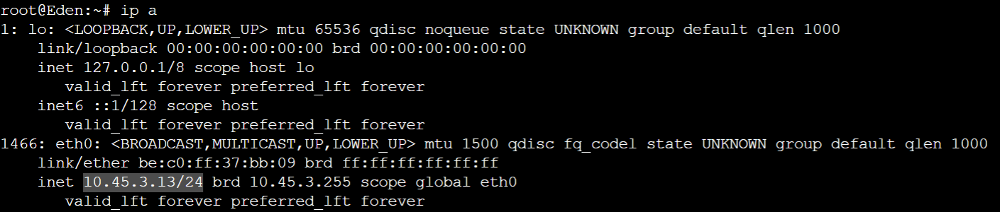